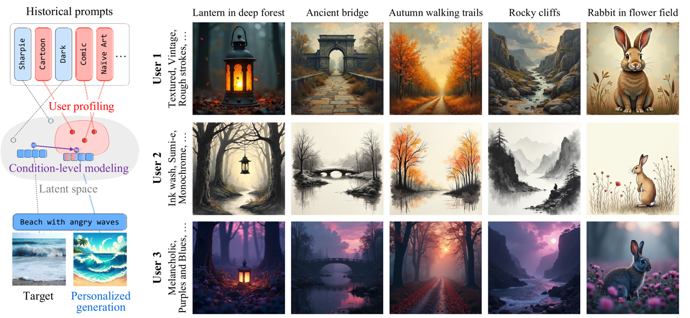
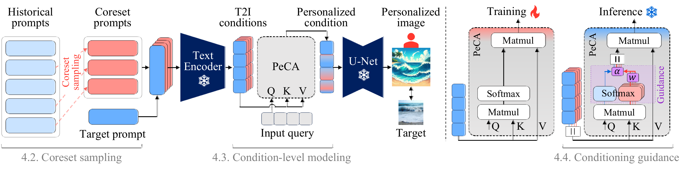
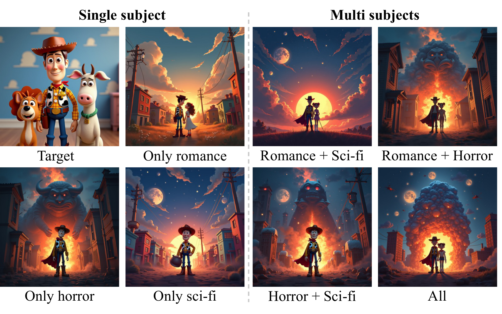
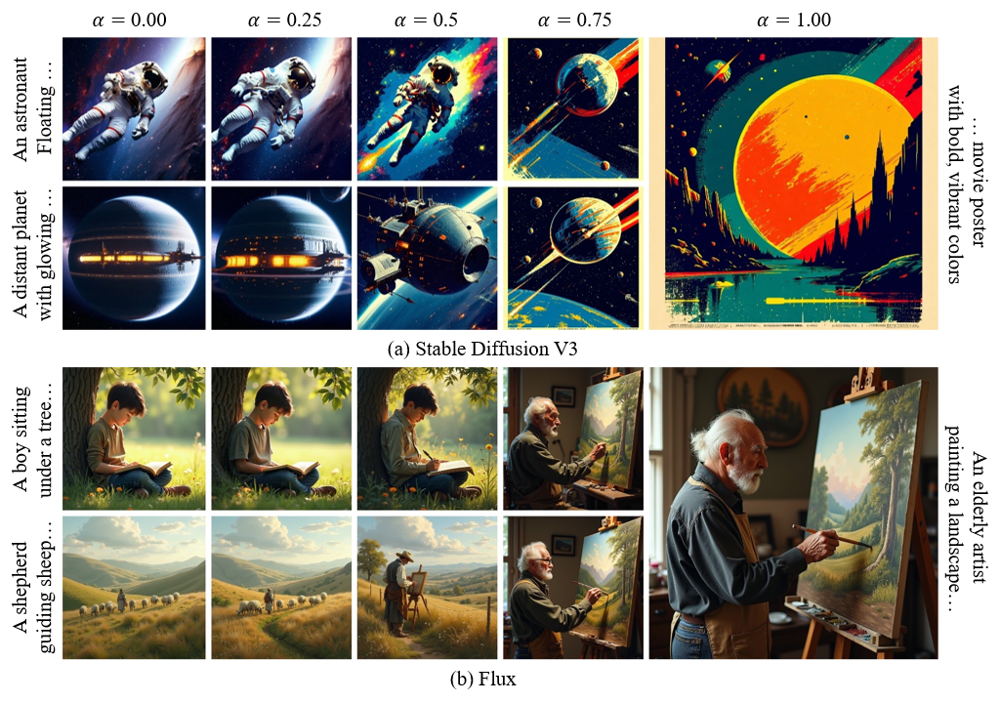

# DrUM (**D**raw **You**r **M**ind)

[](https://huggingface.co/Burf/DrUM)
[](https://pytorch.org/)
[](https://github.com/huggingface/diffusers)
[](https://opensource.org/licenses/MIT)


This repository hosts the official implementation of:

[Hyungjin Kim](https://scholar.google.com/citations?user=HrMSrN0AAAAJ&hl), [Seokho Ahn](https://scholar.google.com/citations?user=EputdKkAAAAJ&hl), and [Young-Duk Seo](https://mysid88.github.io/homepage/home), **Draw Your Mind: Personalized Generation via Condition-Level Modeling in Text-to-Image Diffusion Models**, [Paper arXiv Link](https://arxiv.org/abs/2508.03481)


## News

- [2025.08.05]: Pre-trained weights available on [🤗 HuggingFace](https://huggingface.co/Burf/DrUM)
- [2025.08.05]: Repository created


## Introduction

**DrUM** enables **personalized text-to-image (T2I) generation by integrating reference prompts** into T2I diffusion models. It works with **foundation T2I models such as Stable Diffusion v1/v2/XL/v3 and FLUX**, without requiring additional fine-tuning. DrUM leverages **condition-level modeling in the latent space using a transformer-based adapter**, and integrates seamlessly with **open-source text encoders such as OpenCLIP and Google T5**.

<p align="center">
    
</p>


## Performance

<p align="center">
    
</p>


## Architecture of DrUM

<p align="center">
    
</p>


## Quick Start

This model is designed for easy use with the `diffusers` library as a custom pipeline.

### Setup

```bash
pip install torch torchvision diffusers transformers accelerate safetensors huggingface-hub
```

### Pre-trained weights

Pre-trained adapter weights are available at [🤗 HuggingFace](https://huggingface.co/Burf/DrUM).

### Usage

```python
import torch

from drum import DrUM
from diffusers import DiffusionPipeline

# Load pipeline and attach DrUM
pipeline = DiffusionPipeline.from_pretrained("runwayml/stable-diffusion-v1-5", torch_dtype = torch.bfloat16).to("cuda")
drum = DrUM(pipeline)

# Generate personalized images
images = drum(
    prompt = "a photograph of an astronaut riding a horse",
    ref = ["A retro-futuristic space exploration movie poster with bold, vibrant colors"],
    weight = [1.0],
    alpha = 0.3
)

images[0].save("personalized_image.png")
```

For interactive usage: see [inference.ipynb](inference.ipynb)

For command line usage: see [inference.py](inference.py)

### Key Parameters

| Parameter | Description | Value |
|-----------|-------------|-------|
| prompt | Target prompt | String |
| ref | Reference prompts | List of strings |
| alpha | Personalization degree | Float (0-1) |
| weight | Reference weights | List of floats |
| sampling | Reference coreset sampling | Boolean |

### Supported foundation T2I models

DrUM works with a wide variety of foundation T2I models that uses text encoders with same weights:

| Architecture | Pipeline | Text encoder | DrUM weight |
|--------------|----------------|-|-------------|
| Stable Diffusion v1 | `runwayml/stable-diffusion-v1-5`, `prompthero/openjourney-v4`,<br>`stablediffusionapi/realistic-vision-v51`,`stablediffusionapi/deliberate-v2`,<br>`stablediffusionapi/anything-v5`, `WarriorMama777/AbyssOrangeMix2`, ... | `openai/clip-vit-large-patch14` | `L.safetensors` |
| Stable Diffusion v2 | `stabilityai/stable-diffusion-2-1`, ... | `openai/clip-vit-huge-patch14` | `H.safetensors` |
| Stable Diffusion XL | `stabilityai/stable-diffusion-xl-base-1.0`, ... | `openai/clip-vit-large-patch14`,<br>`laion/CLIP-ViT-bigG-14-laion2B-39B-b160k` | `L.safetensors`,<br>`bigG.safetensors` |
| Stable Diffusion v3 | `stabilityai/stable-diffusion-3.5-large`<br>`stabilityai/stable-diffusion-3.5-medium`, ... | `openai/clip-vit-large-patch14`,<br>`laion/CLIP-ViT-bigG-14-laion2B-39B-b160k`,<br>`google/t5-v1_1-xxl` | `L.safetensors`,<br>`bigG.safetensors`,<br>`T5.safetensors` |
| FLUX | `black-forest-labs/FLUX.1-dev`, ... | `openai/clip-vit-large-patch14`,<br>`google/t5-v1_1-xxl` | `L.safetensors`<br>`T5.safetensors` |

### Training

To train your own DrUM: see [train.py](train.py)


## Subject transfer

<p align="center">
    
</p>


## Degree of personalization

<p align="center">
    
</p>


## Adaptability

<p align="center">
    
</p>


## Citation

```
@inproceedings{kim2025drum,
	title={Draw Your Mind: Personalized Generation via Condition-Level Modeling in Text-to-Image Diffusion Models},
	author={Hyungjin Kim, Seokho Ahn, and Young-Duk Seo},
	booktitle={Proceedings of the IEEE/CVF International Conference on Computer Vision (ICCV)},
	year={2025}
}
```


## License

This project is licensed under the MIT License.